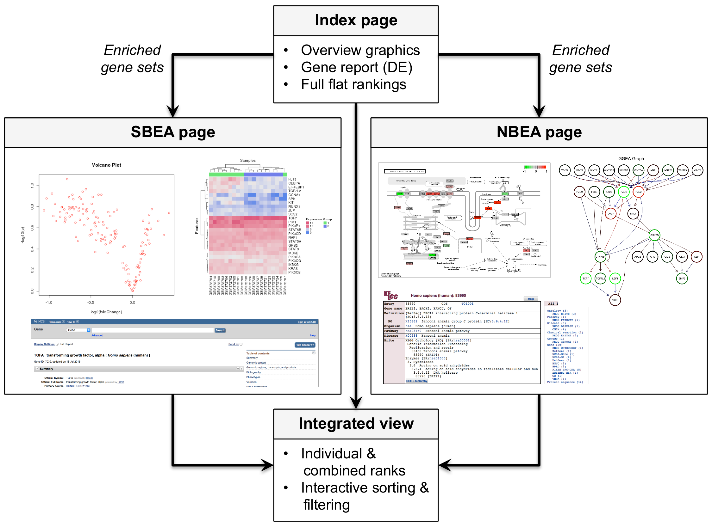

# (PART) Enrichment analysis {-}

# Set-based enrichment analysis

```{r setup, echo=FALSE, results='asis'}
rebook::chapterPreamble()
rebook::extractCached("RNAseq.Rmd", "idmap-airway", "airSE")
suppressPackageStartupMessages({ 
    library(EnrichmentBrowser)
})
```

## Gene sets

We are now interested in whether pre-defined sets of genes that are known to 
work together, e.g. as defined in the [Gene Ontology](http://www.geneontology.org) 
or the [KEGG](http://www.genome.jp/kegg) pathway annotation, are coordinately 
differentially expressed. 

The function `getGenesets` can be used to download gene sets from databases such
as GO and KEGG. 
Here, we use the function to download all KEGG pathways for a chosen organism
(here: _Homo sapiens_) as gene sets.

```{r kegg}
kegg.gs <- getGenesets(org = "hsa", db = "kegg")
kegg.gs[1:2]
```

Analogously, the function `getGenesets` can be used to retrieve GO terms of a 
selected ontology (here: biological process, BP) as defined in the *GO.db*
annotation package.

```{r go, message = FALSE}
go.gs <- getGenesets(org = "hsa", db = "go", onto = "BP", mode = "GO.db")
go.gs[1:2]
```

If provided a file, the function `getGenesets` parses user-defined gene sets
from GMT file format.
Here, we use this functionality for reading a list of already downloaded
KEGG gene sets for *Homo sapiens* containing NCBI Entrez Gene IDs.


```{r gmt}
data.dir <- system.file("extdata", package = "EnrichmentBrowser")
gmt.file <- file.path(data.dir, "hsa_kegg_gs.gmt")
hsa.gs <- getGenesets(gmt.file)
hsa.gs[1:2]
```

Note #1: Gene set collections for 11 different species from the  
[Molecular Signatures Database (MSigDB)](http://software.broadinstitute.org/gsea/msigdb/collections.jsp) can be obtained using `getGenesets` with `db = "msigdb"`.
For example, the *H*allmark gene set collection can be obtained from MSigDB via: 

```{r msigdb, message = FALSE}
hall.gs <- getGenesets(org = "hsa", db = "msigdb", cat = "H") 
hall.gs[1:2]
```

Note #2: Gene set libraries from the comprehensive 
[Enrichr](https://amp.pharm.mssm.edu/Enrichr/#stats) collection for 5 different species 
can be obtained using `getGenesets` with `db = "enrichr"`.
For example, gene sets based on transcription factor interactions can be obtained
from Enrichr via:

```{r enrichr, eval = FALSE}
tfppi.gs <- getGenesets(org = "hsa", db = "enrichr", lib = "Transcription_Factor_PPIs")
tfppi.gs[1:2]
```

Note #3: The `idMap` function can be used to map gene sets from NCBI Entrez Gene
IDs to other common gene ID types such as ENSEMBL gene IDs or HGNC symbols.\\
For example, to map the gene sets from Entrez Gene IDs to gene symbols:

```{r idmap-GS}
hsa.gs.sym <- idMap(hsa.gs, org = "hsa", from = "ENTREZID", to = "SYMBOL")
hsa.gs.sym[1:2]
```

## Microbe sets

## GO/KEGG overrepresentation analysis

A variety of gene set analysis methods have been proposed
[Khatri et al., 2012](https://doi.org/10.1371/journal.pcbi.1002375).
The most basic, yet frequently used, method is the over-representation analysis
(ORA) with gene sets defined according to GO or KEGG.
As outlined in the first section, ORA tests the overlap between DE genes
(typically DE *p*-value < 0.05) and genes in a gene set based on the 
hypergeometric distribution.


```{r ora}
ora.air <- sbea(method = "ora", se = airSE, gs = kegg.gs, perm = 0)
gsRanking(ora.air)
```

Such a ranked list is the standard output of most existing enrichment tools.
Using the `eaBrowse` function creates a HTML summary from which each
gene set can be inspected in more detail.

```{r, echo=FALSE}

```

```{r eaBrowse, message=FALSE, eval = FALSE}
eaBrowse(ora.air)
```

The resulting summary page includes for each significant gene set

- a gene report, which lists all genes of a set along with fold change and DE
$p$-value (click on links in column `NR.GENES`),
- interactive overview plots such as heatmap and volcano plot (column
`SET.VIEW`, supports mouse-over and click-on),
- for KEGG pathways: highlighting of differentially expressed genes on the
pathway maps (column `PATH.VIEW`, supports mouse-over and click-on).

Note #1: [Young et al., 2010](https://doi.org/10.1186/gb-2010-11-2-r14), have
reported biased results for ORA on RNA-seq data due to over-detection of
differential expression for long and highly expressed transcripts. The
[goseq](http://bioconductor.org/packages/goseq)
package and `limma::goana` implement possibilities to adjust ORA for gene length
and abundance bias.

Note #2: Independent of the expression data type under investigation, overlap
between gene sets can result in redundant findings. This is well-documented for
GO (parent-child structure,
[Rhee et al., 2008](https://doi.org/10.1038/nrg2363)) and KEGG (pathway
overlap/crosstalk,
[Donato et al., 2013](https://doi.org/10.1101/gr.153551.112)). The
[topGO](http://bioconductor.org/packages/topGO)
package (explicitly designed for GO) and
[mgsa](http://bioconductor.org/packages/mgsa)
(applicable to arbitrary gene set definitions) implement
modifications of ORA to account for such redundancies.

## Functional class scoring & permutation testing

A major limitation of ORA is that it restricts analysis to DE genes, excluding
genes not satisfying the chosen significance threshold (typically the vast
majority).

This is resolved by gene set enrichment analysis (GSEA), which scores the
tendency of gene set members to appear rather at the top or bottom of the
ranked list of all measured genes
[Subramanian et al., 2005](https://doi.org/10.1073/pnas.0506580102). The
statistical significance of the enrichment score (ES) of a gene set is assessed
via sample permutation, i.e. (1) sample labels (= group assignment) are
shuffled, (2) per-gene DE statistics are recomputed, and (3) the enrichment
score is recomputed. Repeating this procedure many times allows to determine
the empirical distribution of the enrichment score and to compare the observed
enrichment score against it. 

As GSEA's permutation procedure involves re-computation of per-gene DE
statistics, adaptations are necessary for RNA-seq. 
When analyzing RNA-seq datasets with expression values given as logTPMs
(or logRPKMs / logFPKMs), the available set-based enrichment methods can be
applied as for microarray data.
However, when given raw read counts as for the airway dataset, we recommend to
first apply a variance-stabilizing transformation such as `voom` to
arrive at library-size normalized logCPMs. 

```{r vst}
airSE <- normalize(airSE, norm.method = "vst")
```

The mean-variance relationship of the transformed data is similar to what is
observed for microarray data, simplifying the application of legacy enrichment
methods such as GSEA and PADOG to RNA-seq data, and enable the use of fast and
established methods. Here, we carry out GSEA with 1000 permutations.

```{r gsea}
gsea.air <- sbea(method = "gsea", se = airSE, gs = kegg.gs, perm = 1000)  
```

While it might be in some cases necessary to apply permutation-based GSEA for
RNA-seq data, there are also alternatives avoiding permutation. Among them is
ROtAtion gene Set Testing (ROAST), which uses rotation instead of permutation
[Wu et al., 2010](https://doi.org/10.1093/bioinformatics/btq401).


```{r roast}
roast.air <- sbea(method = "roast", se = airSE, gs = hsa.gs)
gsRanking(roast.air)  
```

A selection of additional methods is also available:

```{r sbea-methods}
sbeaMethods()
```
